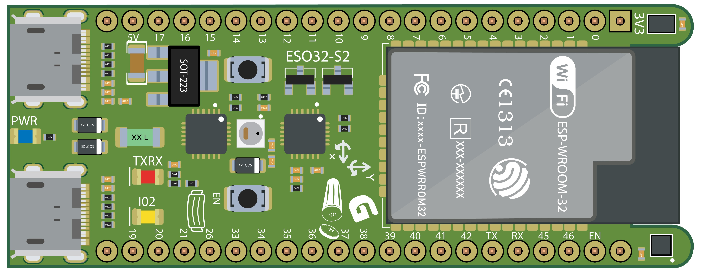
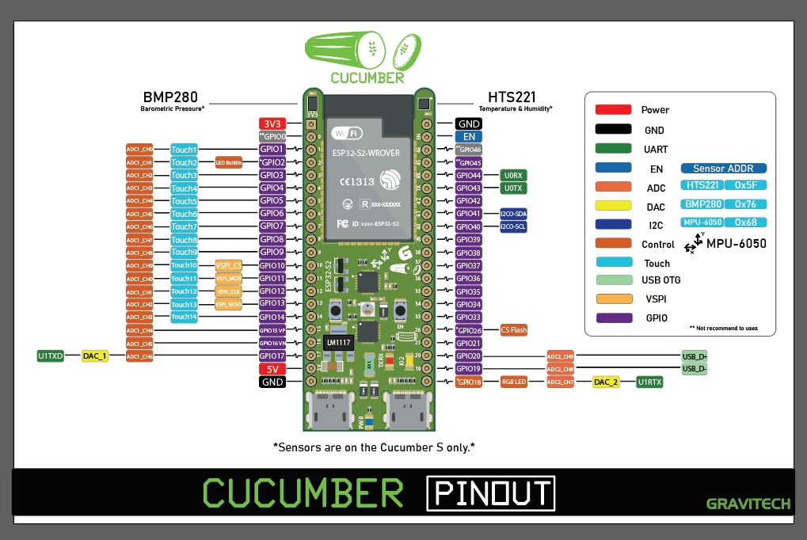

<h1>CUCUMBER white esp32s2</h1>

<h3>By</h3> <a href="www.gravitechthai.com">www.gravitechthai.com</a>
<h2>Series R</h2>

<h3>Spec  |R  | RS  |  RI | RIS</h3>
----- |----- | ----- | ----- | ----- |
Sensor on board|| ◙ |  |◙
RGB                   |◙ | ◙ | ◙ | ◙ |
Flash                 |4MB | 4MB | 4MB | 4MB |
PSRAM                 |2MB | 2MB | 2MB | 2MB |
ESP Module                 |ESP32-S2-WROVER |ESP32-S2-WROVER | ESP32-S2-WROVER-I | ESP32-S2-WROVER-I	 |
---
<h2>Series M</h2>

<h3>Spec  |M  | MS  |  MI | MIS</h3>
----- |----- | ----- | ----- | ----- |
Sensor on board||◙  |  |◙
RGB                   |◙ | ◙ | ◙ | ◙ |
Flash                 |4MB | 4MB | 4MB | 4MB |
PSRAM                 | |  |  |  |
ESP Module                 |ESP32-S2-WROVER |ESP32-S2-WROVER | ESP32-S2-WROVER-I | ESP32-S2-WROVER-I	 |
---

  
